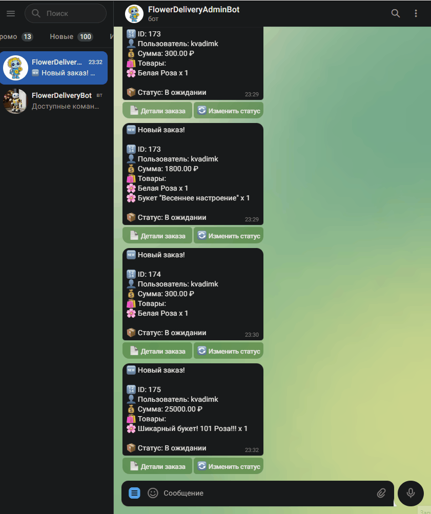

<h1 align="center">🌸 Flower Delivery</h1>
<h3 align="center">🚀 Онлайн-платформа для доставки цветов с Telegram-ботами</h3>

<p align="center">
  
</p>

---

## 🛠️ Технологический стек


---

## 📖 Описание проекта

Flower Delivery — это онлайн-платформа для продажи цветов с интеграцией Telegram-ботов. Проект включает:

- **Пользовательский интерфейс**: добавление в корзину, оформление заказов, отзывы.
- **Telegram-боты**: уведомления, управление заказами, аналитика.
- **Админ-панель**: управление товарами, заказами и отчётами.

---

## 🚀 Быстрый старт

### Установка зависимостей

```bash
pip install -r requirements.txt
```
1. ⚙️ Настройка окружения
Создайте файл .env в папке telegram_bot и добавьте следующие переменные:

- BOT_TOKEN — токен основного Telegram-бота.
- API_URL — URL API.
- SITE_URL — URL сайта.
- TELEGRAM_IDS — идентификаторы Telegram-пользователей для уведомлений.
- ADMIN_BOT_TOKEN — токен админ-бота.
- ADMIN_TELEGRAM_IDS — идентификаторы администраторов для уведомлений.
- ADMIN_API_TOKEN — токен для доступа к административному API.
2. Настройте Redis для работы на порту 6380 либо на порту 6379 и укажите следующие параметры в settings.py для Celery:

```python
CELERY_BROKER_URL = 'redis://localhost:6380/0'
CELERY_RESULT_BACKEND = 'redis://localhost:6380/0'
```

## 🚀 Запуск проекта

### Запуск сервера Django
Для запуска основного сервера выполните команду:

```bash
python manage.py runserver
```

## Настройка для работы с Celery и Redis
Для запуска Celery используйте следующую команду:

```bash
celery -A flower_delivery worker -l info -P solo
```

## Запуск ботов
Запустите telegram_bot и telegramadmin_bot, чтобы активировать уведомления и административные функции в Telegram. Подробности можно найти в telegram_bot/main.py и telegramadmin_bot/main.py.


```bash
python manage.py run_admin_bot
```

```bash
python telegram_bot/bot/main.py
```

## 🌟 Основные функции

### Пользовательский интерфейс
- 🛒 **Корзина**: Добавление, обновление и удаление товаров.
- 📦 **Заказы**: Оформление заказов, просмотр истории и повтор заказов.
- 💬 **Отзывы**: Написание и просмотр отзывов на товары.

## 🤖 Telegram Боты

Проект включает два Telegram-бота:

### Основной бот (`telegram_bot`)
- Для оставления и отслеживания заказов пользователями.
- Основные команды:
  - `/start` — начало работы.
  - `/help` — показать все команды.
  - `/link <username>` — связать Telegram аккаунт с учетной записью на сайте.
  - `/order` — оформление заказа.
  - `/status <order_id>` — проверка статуса заказа.
  - `/clear` — очистить чат.

### Админ-бот (`telegramadmin_bot`)
- Для уведомлений и команд администратора.
- Основные команды:
  - `/start` — начало работы.
  - `/orders` — список последних заказов.
  - `/order <id>` — детали заказа.
  - `/changestatus <id> <status>` — изменение статуса заказа.
  - `/analytics` — аналитика за последние 30 дней.

---

## 🧩 Структура проекта

```plaintext
flower_delivery/
├── cart/          # Управление корзиной
├── orders/        # Управление заказами
├── products/      # Каталог товаров
├── reports/       # Генерация отчётов
├── reviews/       # Отзывы
├── telegram_bot/  # Пользовательский бот
└── telegramadmin_bot/  # Админ-бот
```
## 📊 API

### Основные API-эндпоинты

| Метод | Эндпоинт                     | Описание                              |
|-------|------------------------------|---------------------------------------|
| POST  | `/api/link_telegram_id/`     | Привязка Telegram ID к пользователю.  |
| GET   | `/api/orders/`               | Получение списка заказов.             |
| GET   | `/api/products/`             | Получение каталога товаров.           |

---

## 📸 Демонстрация

## Платформа


## Боты


---

## 🧪 Тестирование

Для запуска тестов используйте команду:

```bash
python manage.py test --pattern="test_*.py"
```

## 🖥️ Серверная часть (Backend)

Проект построен на **Django** и включает следующие технологии:

- **Django Rest Framework** — для построения REST API.  
  

- **Celery** — для асинхронных задач, таких как уведомления через ботов.  
  

- **Redis** — в качестве брокера для Celery.  
  

---


## 🔐 Аутентификация через социальные сети

Проект поддерживает вход через социальные сети:

- 


- 


-   

### Настройка аутентификации

1. Создайте приложение в выбранной социальной сети (Google, GitHub, VK).
2. Добавьте ключи API в файл `.env`:

```env
SOCIAL_AUTH_GOOGLE_OAUTH2_KEY=ваш_google_client_id
SOCIAL_AUTH_GOOGLE_OAUTH2_SECRET=ваш_google_client_secret

SOCIAL_AUTH_GITHUB_KEY=ваш_github_client_id
SOCIAL_AUTH_GITHUB_SECRET=ваш_github_client_secret

SOCIAL_AUTH_VK_OAUTH2_KEY=ваш_vk_app_id
SOCIAL_AUTH_VK_OAUTH2_SECRET=ваш_vk_app_secret
```

## 📜 Лицензия

Проект распространяется под лицензией **[MIT](LICENSE)**.  
[](https://opensource.org/licenses/MIT)

---

## 📞 Контакты

[](https://t.me/KVadim_K)
[](mailto:kvadimk@yandex.ru)
[](https://github.com/KVadim-K)
---

## 🚀 Будущие улучшения

- **Интеграция с мессенджерами**:  
  Добавление поддержки WhatsApp и Viber для расширения аудитории.

- **Рекомендательная система**:  
  Внедрение машинного обучения для персонализированных рекомендаций товаров.

- **Мультиязычность**:  
  Поддержка нескольких языков для международной аудитории.

---

## 🙏 Благодарности

Спасибо всем, кто поддерживал и вдохновлял на создание этого проекта!  
Особая благодарность:

- [](https://zerocoder.ru) – за отличные курсы и материалы
- **Сообществу Python** – за бесценные ресурсы и активную поддержку
- **Моей семье и друзьям** – за мотивацию и вдохновение


---

## 📚 Полезные ссылки

- [Документация Django](https://docs.djangoproject.com/)  
- [Документация Celery](https://docs.celeryproject.org/)  
- [Документация Telegram Bot API](https://core.telegram.org/bots/api)  
- [Официальный сайт Redis](https://redis.io/)  


